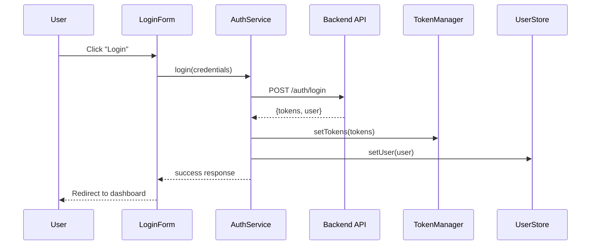

> [!note]
> An example report that might be genreated by code-research.md.

# User Authentication Flow Analysis

**Analysis Date:** August 18, 2025  
**Context:** Understanding the complete user authentication flow to implement OAuth2 social login features  
**Tags:** authentication, login, security, user-management, oauth

## Overview

This report traces the end-to-end execution flow of user authentication in the application, from initial login attempt to session establishment.

## Key Files (in order of importance)

1. `src/auth/AuthController.tsx:23` - Main authentication entry point
2. `src/services/AuthService.ts:45` - Core authentication logic
3. `src/middleware/AuthMiddleware.ts:12` - Request validation
4. `src/store/UserStore.ts:67` - User state management
5. `src/utils/TokenManager.ts:89` - JWT token handling
6. `src/components/LoginForm.tsx:156` - UI authentication form

## Main Entry Points

| Trigger                    | Entry Point             | File Path                             |
| -------------------------- | ----------------------- | ------------------------------------- |
| User clicks "Login" button | `handleLoginSubmit()`   | `src/components/LoginForm.tsx:156`    |
| API route access           | `authenticateRequest()` | `src/middleware/AuthMiddleware.ts:12` |
| Page load with session     | `validateSession()`     | `src/auth/AuthController.tsx:78`      |

## Execution Flow

### 1. User Interaction - Login Form Submission

```javascript
// src/components/LoginForm.tsx:156
const handleLoginSubmit = async (credentials) => {
  setLoading(true);
  const result = await AuthService.login(credentials);
  // Flow continues to step 2
};
```

### 2. Authentication Service Processing

```javascript
// src/services/AuthService.ts:45
async login(credentials) {
  const response = await api.post('/auth/login', credentials);
  if (response.success) {
    TokenManager.setTokens(response.tokens);
    UserStore.setUser(response.user);
  }
  return response;
}
```

### 3. Token Management and Storage

```javascript
// src/utils/TokenManager.ts:89
setTokens(tokens) {
  localStorage.setItem('accessToken', tokens.access);
  localStorage.setItem('refreshToken', tokens.refresh);
  this.scheduleTokenRefresh(tokens.expiresIn);
}
```

### 4. User State Update

```javascript
// src/store/UserStore.ts:67
setUser(userData) {
  this.user = userData;
  this.isAuthenticated = true;
  this.notifySubscribers();
}
```

## Execution Sequence Diagram



## Critical Decision Points

### Authentication Validation (`src/services/AuthService.ts:67`)

- **Valid credentials**: Proceed with token generation
- **Invalid credentials**: Return error, increment failed attempts
- **Account locked**: Return locked status, require unlock flow

### Token Refresh Logic (`src/utils/TokenManager.ts:123`)

- **Token valid**: Continue with request
- **Token expired**: Attempt refresh using refresh token
- **Refresh failed**: Redirect to login, clear stored tokens

## Error Handling

| Error Type          | Handler Location      | Recovery Action                 |
| ------------------- | --------------------- | ------------------------------- |
| Invalid credentials | `AuthService.ts:89`   | Show error message, allow retry |
| Network timeout     | `AuthService.ts:112`  | Retry with exponential backoff  |
| Account locked      | `AuthService.ts:134`  | Redirect to account recovery    |
| Token expired       | `TokenManager.ts:156` | Automatic refresh attempt       |

## Environment Variables

```bash
AUTH_SECRET_KEY=jwt_signing_key
TOKEN_EXPIRY_MINUTES=60
REFRESH_TOKEN_EXPIRY_DAYS=7
MAX_LOGIN_ATTEMPTS=3
```

## User Journey

1. **Landing Page**: User sees login form (`/login` route)
2. **Credential Entry**: User fills email/password fields
3. **Submission**: Form validates and submits to backend
4. **Processing**: Backend validates, generates tokens
5. **Success**: User redirected to dashboard with active session
6. **Session Persistence**: Tokens stored, auto-refresh scheduled

## Performance Considerations

- **Token refresh**: Scheduled 5 minutes before expiry to prevent interruption
- **Credential validation**: Client-side validation before API call
- **Session persistence**: LocalStorage used for token storage (consider security implications)

## Security Notes

- Passwords are hashed using bcrypt with salt rounds of 12
- JWT tokens include user role and permissions
- Refresh tokens are rotated on each use
- Failed login attempts are rate-limited after 3 attempts

## Related Functionality

- Password reset flow: `src/auth/PasswordReset.tsx:45`
- User registration: `src/auth/Registration.tsx:23`
- Session timeout handling: `src/middleware/SessionTimeout.ts:67`

---

This analysis provides the foundation for implementing OAuth2 social login by understanding the existing authentication flow structure and identifying integration points for external providers.
