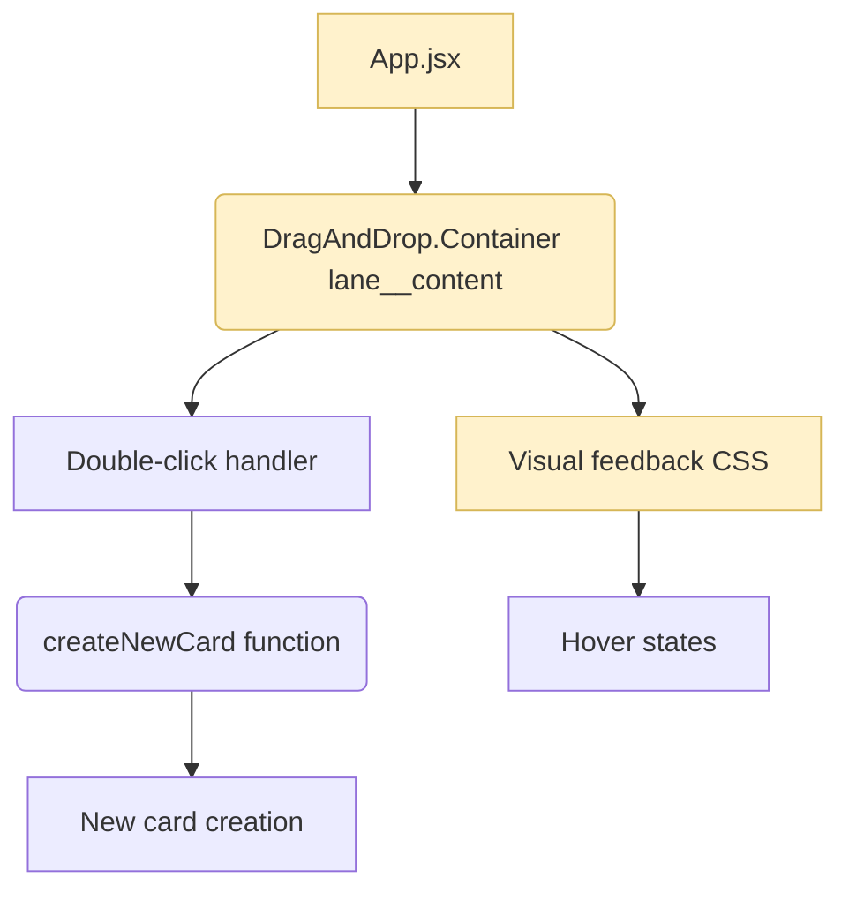

> [!note]
>
> **About this file:** This was done for [BaldissaraMatheus/Tasks.md#147](https://github.com/BaldissaraMatheus/Tasks.md/issues/147). The orginal prompt was:
>
> ```
> Plan this feature: Double click lane to add new card
> ```

# Double Click Lane to Add New Card

## 1. Requirements

### Introduction

Enhance the existing "Create and Organize Tasks/Notes" functionality by adding double-click interaction to lanes for creating new tasks/notes. This provides a more intuitive alternative to the existing "+" button for card creation, building upon the established task management workflow.

### Out of scope

- Customizing double-click timing/sensitivity
- Adding double-click functionality to other UI elements
- Changing existing card creation behavior via the "+" button

### Stories

#### 1. Double-click task/note creation

**Story:** AS a user, I WANT to double-click on a lane area, SO THAT I can quickly create a new task/note in that lane.

- 1.1. WHEN the user double-clicks on an empty area within a lane content area, THEN the system SHALL create a new task/note in that lane
- 1.2. WHEN the user double-clicks on an existing task/note card, THEN the system SHALL open the card for editing (existing behavior)
- 1.3. WHEN the user double-clicks on lane header elements (name, buttons), THEN the system SHALL NOT create a new task/note

#### 2. Visual feedback

**Story:** AS a user, I WANT visual feedback when double-clicking on a lane, SO THAT I understand the interaction is available.

- 2.1. WHEN the user hovers over an empty lane content area, THEN the system SHALL show a subtle visual hint that double-click is available
- 2.1. WHEN the user double-clicks on lane header elements (name, buttons), THEN the system SHALL NOT create a new task/note

## 2. Design

### Overview

Enhance the existing lane content area with double-click event handling. Leverage the existing `createNewCard()` function to maintain consistency with current task/note creation flow, following established patterns from the "Create and Organize Tasks/Notes" user story.

### Files

**New files:**

- None

**Modified files:**

- `frontend/src/App.jsx` - Add double-click handler to lane content areas
- `frontend/src/stylesheets/index.css` - Add CSS for visual feedback

**Reference files:**

- `frontend/src/components/lane-name.jsx` - Reference for existing task/note creation button
- `docs/architecture/frontend-core.md` - Frontend architecture documentation
- `docs/architecture/ui-components.md` - UI components documentation
- `docs/architecture/stories.md` - Existing user stories and epics

### Component graph



### Components

#### Enhanced lane content area

- **Location**: `frontend/src/App.jsx` (within lane rendering)
- Add `onDblClick` handler to `DragAndDrop.Container` with class `lane__content`
- Prevent double-click when clicking on cards or when drag is disabled

```javascript
// Within the lane rendering in App.jsx
<DragAndDrop.Container
  class="lane__content"
  group="cards"
  id={`lane-content-${lane}`}
  onChange={handleCardsSortChange}
  onDblClick={(e) => handleLaneDoubleClick(e, lane)}
>
```

#### Double-click handler function

- **Location**: `frontend/src/App.jsx`
- Handles double-click events on lane content areas
- Prevents card creation when clicking on existing cards

```javascript
function handleLaneDoubleClick(event, lane) {
  // Prevent if clicking on a card element
  if (event.target.closest(".card")) {
    return;
  }

  // Prevent if drag is disabled (sorted view)
  if (disableCardsDrag()) {
    return;
  }

  // Create new card using existing function
  createNewCard(lane);
}
```

### Error handling

- Check if target is a card element before creating new card
- Respect existing drag disabled state (when sorting is active)
- Use existing validation from `createNewCard()` function

### Testing strategy

```jsx
// App.test.jsx additions
describe("Lane double-click functionality", () => {
  test("creates new card when double-clicking empty lane area");
  test("does not create card when double-clicking on existing card");
  test("does not create card when double-clicking in sorted view");
  test("shows visual feedback on hover");
  test("applies visual feedback on first click");
});
```

## 3. Tasks

### 1. Add double-click handler

- [ ] 1.1. **Create handler function:** Add `handleLaneDoubleClick(event, lane)` function in `App.jsx` (fulfills Req 1.1)
  - Check if target is not a card element
  - Call existing createNewCard function
- [ ] 1.2. **Add event listener:** Add `onDblClick` prop to `DragAndDrop.Container` (fulfills Req 1.1)
- [ ] 1.3. **Test basic functionality:** Write test to verify double-click creates new card in correct lane
- [ ] 1.4. **Prevent card conflicts:** Add check to return early if clicking on existing card (fulfills Req 1.2, 1.3)
- [ ] 1.5. **Test conflict prevention:** Write test to verify double-click on existing card doesn't create new card

### 2. Add visual feedback

- [ ] 2.1. **Add hover styles:** Create CSS for `.lane__content:hover` to show subtle visual hint (fulfills Req 2.1)
- [ ] 2.2. **Add click feedback:** Create CSS for `.lane__content:active` (fulfills Req 2.2)
- [ ] 2.3. **Test visual feedback:** Write test to verify CSS classes are applied correctly

### 3. Handle edge cases

- [ ] 3.1. **Respect sort state:** Return early if `disableCardsDrag()` is true (fulfills existing sort behavior)
- [ ] 3.2. **Test sort state:** Write test to verify double-click doesn't work when sorting is active
- [ ] 3.3. **Prevent header conflicts:** Ensure double-click on lane header elements doesn't trigger card creation (fulfills Req 1.3)
