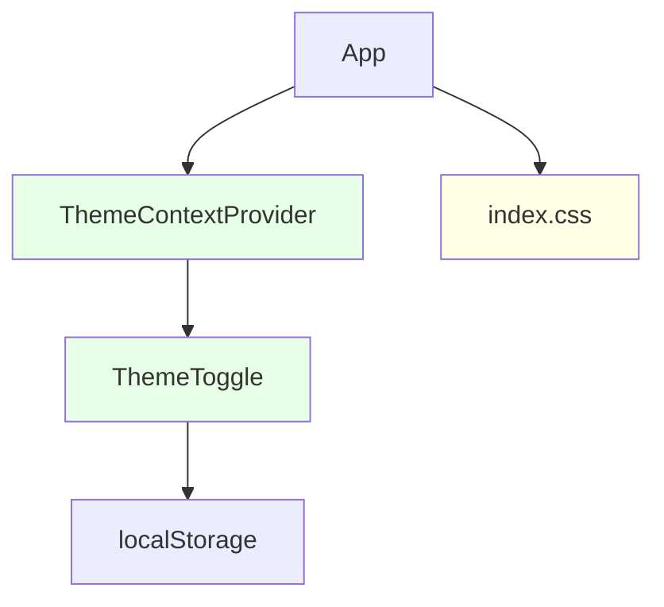

# Theme toggle feature

## Requirements

### Introduction

Add a theme toggle (light/dark) to the React TypeScript app. Allows users to switch between light and dark modes.

### Rationale

- Improves accessibility and user comfort
- Modernizes UI
- Solves lack of dark mode for night users

### Out of scope

- No system theme detection
- No custom themes beyond light/dark
- No persistence across devices

### Stories

#### 1. Theme toggle

**Story:** AS a user, I WANT to switch between light and dark themes, SO THAT I can use the app comfortably in any lighting.

- 1.1. **Theme toggle button**
  - _WHEN_ user clicks theme toggle,
  - _THEN_ app _shall_ switch between light and dark themes instantly
- 1.2. **Persistence**
  - _WHEN_ user reloads the app,
  - _THEN_ app _shall_ remember last selected theme

## Design

### Overview

- Use React context for theme state
- Store theme in localStorage for persistence
- ThemeToggle component for UI
- CSS classes for light/dark themes

### Files

- New: `src/components/ThemeToggle.tsx`
- New: `src/context/ThemeContext.tsx`
- Modified: `src/App.tsx`, `src/index.css`

### Component graph



### Data models

```typescript
type Theme = "light" | "dark";

interface ThemeContextType {
  theme: Theme;
  setTheme: (theme: Theme) => void;
}
```

### CSS classes

- `.theme-light` — base light theme
- `.theme-dark` — base dark theme

### Components

#### ThemeToggle component

- **Location**: `src/components/ThemeToggle.tsx`
- Renders a button to toggle theme

```typescript
interface ThemeToggleProps {
  className?: string;
}
export function ThemeToggle(props: ThemeToggleProps): JSX.Element;
```

#### ThemeContext

- **Location**: `src/context/ThemeContext.tsx`
- Provides theme state and setter

### Error handling

- Fallback to "light" if localStorage is unavailable or corrupted

### Testing strategy

```tsx
// ThemeToggle.test.tsx
describe("ThemeToggle", () => {
  test("toggles theme on click");
  test("shows correct icon for current theme");
});

// ThemeContext.test.tsx
describe("ThemeContext", () => {
  test("provides theme value to children");
  test("persists theme in localStorage");
  test("defaults to light if localStorage fails");
});
```

## Tasks

### Parallel phase

These are tasks that can be done in parallel by subagents.

#### 1. Theme context

- [ ] 1.1. **Create ThemeContext:** Create `src/context/ThemeContext.tsx` (Req 1.1, 1.2)
  - Implement context with theme state and setter
  - Add localStorage persistence
- [ ] 1.2. **Test ThemeContext:** Write tests for context logic and persistence

#### 2. Theme toggle component

- [ ] 2.1. **Create ThemeToggle:** Create `src/components/ThemeToggle.tsx` (Req 1.1)
  - Button to toggle theme
  - Show icon for current theme
- [ ] 2.2. **Test ThemeToggle:** Write tests for toggle behavior and UI

#### 3. CSS theme classes

- [ ] 3.1. **Add CSS classes:** Update `src/index.css` (Req 1.1)
  - Add `.theme-light` and `.theme-dark` styles
- [ ] 3.2. **Test CSS application:** Write tests to verify correct class is applied

### Final phase

These are tasks that should be done after the parallel phase.

#### 4. Integrate context and toggle

- [ ] 4.1. **Wrap App with ThemeContextProvider:** Update `src/App.tsx` (Req 1.1, 1.2)
  - Provide context to app
  - Apply theme class to root element
- [ ] 4.2. **Add ThemeToggle to UI:** Insert ThemeToggle in main layout
- [ ] 4.3. **Test integration:** Write integration tests for theme switching and persistence
